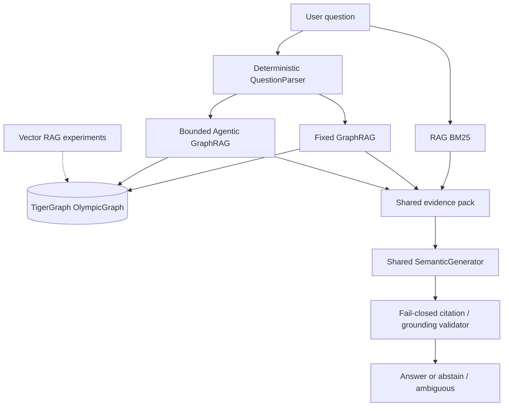

# TigerGraph Agentic GraphRAG

A three-way comparison of retrieval policies over the same Olympic event corpus,
the same evidence packer, and the same `SemanticGenerator`:

1. **Text-only RAG** — BM25 over chunks. No TigerGraph. This is the production RAG retriever.
2. **Fixed GraphRAG** — one typed GSQL retrieval per question.
3. **Bounded Agentic GraphRAG** — deterministic planner/tool selection with hard caps
   (3 iterations / 6 tool calls / 2 follow-ups). Not an unconstrained LLM planner.

TigerGraph vector search (`gsql/05_vector.gsql`) is an **experiment-only** RAG
capability. It is **not** installed by the standard production ingest path and
is **not** the production RAG routing decision. Production RAG remains BM25.

## What TigerGraph is doing

TigerGraph is not a citation store for text chunks. Installed GSQL answers
complete-set aggregations, typed event lookup, venue/date resolution, temporal
previous/next relations, and fail-closed ambiguity. Those operations are why
graph pipelines outperform BM25 on count and relation questions.

Vector search (`gsql/05_vector.gsql`) can rank Chunk embeddings, but that path
is reserved for ablation and engineering gates. GraphRAG and Agentic still use
fixed typed queries, not kNN.

## Architecture



| Pipeline | Flow |
|---|---|
| RAG | question → BM25 → pack → shared generator → citation check |
| GraphRAG | question → parser → one typed GSQL call (`include_chunks=True`) → pack → shared generator → citation check |
| Agentic | question → parser → bounded planner → `retrieve_spec` (no extra hop by default) → optional `event_neighborhood` / `supporting_chunks` → pack → shared generator → citation check |

Gold answers are used only in evaluation. They never enter retrieval or generation.

## Setup

```
python -m pip install -r requirements.txt
copy .env.example .env
```

Fill `.env` locally. Never commit it.

| Need | Variables |
|---|---|
| Live TigerGraph | `TG_HOST`, `TG_GRAPHNAME`, and one of `TG_API_TOKEN` / `TG_JWT_TOKEN` / `TG_SECRET` / `TG_USERNAME`+`TG_PASSWORD` |
| Semantic generation | `LLM_PROVIDER=openai_compatible`, `LLM_BASE_URL`, `LLM_MODEL`, `LLM_API_KEY` |
| Vector experiments (optional) | `EMBEDDING_MODEL`, `EMBEDDING_DIMENSION`, `EMBEDDING_BASE_URL`, `EMBEDDING_API_KEY` |

Corpus JSONL is **not** in Git. Place it at
`_research/hackathon-resources/corpus/corpus.jsonl`.
The official public question file is included in this snapshot at
`_research/hackathon-resources/questions/eval_public.jsonl`
(present on disk; not yet committed).

Without TigerGraph or the LLM provider, unit tests still run; live graph tests
skip, and semantic evaluation cannot reproduce the reported numbers.

## Tests

```
python -m unittest discover -s tests
```

Corpus-backed and live TigerGraph tests skip when those dependencies are missing.
See [docs/reproducibility.md](docs/reproducibility.md).

## Evaluation

Canonical public 100-question three-way (needs corpus + live TigerGraph + semantic provider):

```
python -m scripts.eval_three_way --generator semantic
```

Parser robustness (no live graph required; uses public wording only):

```
python -m unittest tests.test_parser_robustness
```

Measured **published public benchmark** is the 100-question semantic run. Do not mix
it with vector ablations or other engineering experiments:

| Population | RAG (BM25) | Fixed GraphRAG | Agentic GraphRAG |
|---|---:|---:|---:|
| Published public benchmark (100q) | 67% | 98% | 97% |

Full public tables: [docs/metrics.md](docs/metrics.md).

Optional **experiment-only** vector ablation (does not change production routing):

```
python -m scripts.eval_vector_ablation --generator semantic --skip-ingest
```

## Parser

Five operations only: nation lookup, count-over-threshold, argmax competitors,
previous/next event gold, events at venue/date.

The parser uses **closed synonym/shape classes** (case, nations/countries,
over/more than, most/highest number, temporal and venue phrasing). Not an LLM
parser.

## Investigation Console

Judge-facing live console over the production pipelines (BM25 RAG, Fixed GraphRAG, Agentic GraphRAG).

```
python -m scripts.serve_ui
```

Then open `http://127.0.0.1:8765/`.

The main workspace is: question → pipeline (or Compare All) → answer → evidence → investigation trace → evidence diff → graph context → why it continued or stopped → metrics.

Requires the same environment as a live three-way run for graph pipelines (`TG_*`) and semantic generation (`LLM_*`). RAG also needs the corpus at `_research/hackathon-resources/corpus/corpus.jsonl`. If those dependencies are missing, the console stays usable and reports **UNAVAILABLE** instead of fabricating answers. Health checks are read-only. Agentic traces explain why a follow-up ran or why the agent stopped, using only observed planner/tool data.

| Goal | Where |
|---|---|
| Live investigation | **Investigate** — type any question, choose a pipeline, Run |
| Three-way comparison | **Compare** — same question through RAG, GraphRAG, Agentic |
| Published scores | **Benchmark** — published public 100-question three-way |
| Runtime / graph health | **System** — read-only checks; vector is experiment-only |
| Replay | **History** — current browser session only |
| Export | **Reports** — sanitized schema_version=1 JSON |

Export uses `evaluation.trace_export`. Evaluator scoring fields are not shown.

Alternative: `python -m ui --port 8765`.

## Limitations

- The parser is a bounded question-language contract, not open-domain NLU.
- Graph evaluation needs a live `OlympicGraph` with the repo GSQL installed.
- Reported semantic scores need the configured completion provider.
- The corpus is external; this snapshot includes the public question file, not `corpus.jsonl`.
- Benchmarks test this corpus and these templates, not arbitrary natural language.
- Production RAG is BM25. Dense/hybrid vector retrieval is experiment-only.
- GRIP / MCP is not part of the public production runtime.
- Agentic extra hops did not beat Fixed GraphRAG on the public set.

## Docs

- [Architecture (as implemented)](docs/architecture.md)
- [Metrics for judges](docs/metrics.md)
- [Demo questions](docs/demo.md)
- [Reproduction](docs/reproducibility.md)
- Implementation notes: [Fixed GraphRAG](docs/phase6_fixed_graphrag.md),
  [Agentic](docs/phase7_agentic_graphrag.md),
  [Public benchmark runner](docs/phase8_public_benchmark.md)

## License

This repository's original source is released under the [MIT License](LICENSE).
Python packages in `requirements.txt` remain under their own licenses.
